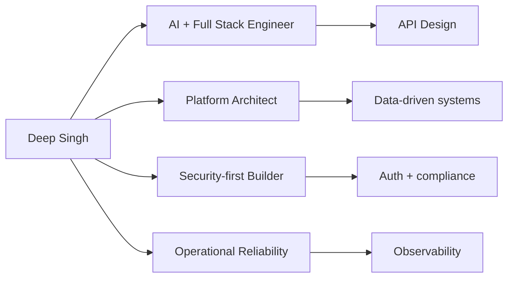
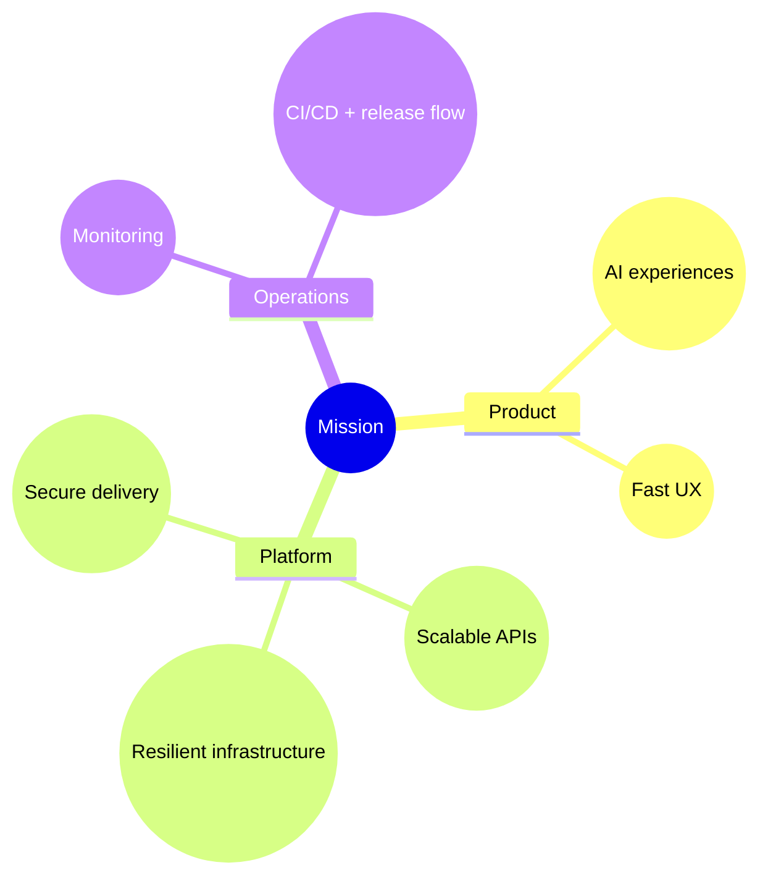
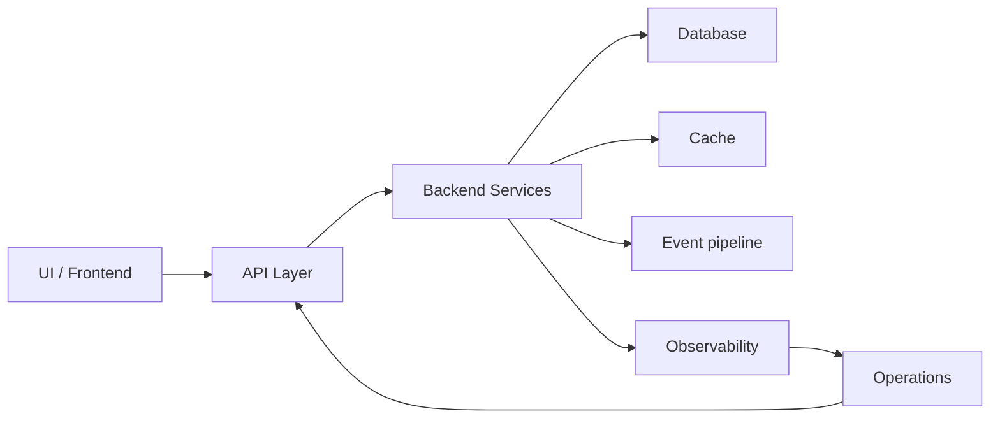

# ⚡ DEEP SINGH

## 🚀 Full Stack Engineer • Product Systems

<p align="center">
  
</p>

<p align="center">
  
</p>

<p align="center">
  <a href="https://deepsingh.netlify.app">Portfolio</a> ·
  <a href="https://linkedin.com/in/simrandeep-singh-7bb74b234">LinkedIn</a>
</p>

<p align="center">
  
  
  
</p>

---

# 🧠 PORTFOLIO

## 👨‍💻 Who Am I?



- Build production-grade platforms and backend services
- Ship AI-enabled product features with observability
- Design secure APIs, multi-tenant flows, and compliance-aware systems
- Optimize delivery, reliability, and operational resilience

---

# 🚀 FEATURED SYSTEMS

<table width="100%">
  <tr>
    <td valign="top" width="50%">
      <strong>LDGERS Platform</strong>
      <ul>
        <li>Finance system architecture with SSL / VAPT compliance</li>
        <li>React Native apps designed for reliability</li>
        <li>Audit-ready reporting, invoicing, and access controls</li>
      </ul>
    </td>
    <td valign="top" width="50%">
      <strong>HRMS + Attendify</strong>
      <ul>
        <li>Multi-tenant HR lifecycle and RBAC dashboards</li>
        <li>Geo-aware attendance, analytics, and policy enforcement</li>
        <li>AI automation for workforce operations</li>
      </ul>
    </td>
  </tr>
</table>

---

# 🧩 CURRENT MISSION



- Enable product velocity while keeping operational risk low
- Use observability as the baseline for decision-making
- Build architecture for data, scale, and stability
- Apply immersive interfaces selectively when they add value

---

# 🛠️ TECH STACK

<p align="center">
  
</p>

---

# ⚙️ SYSTEM DESIGN MINDSET



- Modular architecture with defined boundaries
- Resilient APIs and secure service design
- Observability and operations built in from day one
- Production-ready systems with measurable uptime

---

# 📊 GITHUB ANALYTICS

<p align="center">
  
  
</p>

<p align="center">
  
</p>

---

# 🧠 DEV DNA

```javascript
const deep = {
  mindset: "Build resilient product systems",
  specialization: ["API architecture", "AI-enabled features", "secure delivery"],
  focus: ["scalability", "observability", "operational readiness"],
  currentGoal: "Ship reliable, data-driven platforms at scale"
};
```

---

# 🌐 CONNECT

<p align="center">
  <a href="https://linkedin.com/in/simrandeep-singh-7bb74b234"></a>
</p>

---

<p align="center">
  ⚡ <strong>Not just systems. Reliable product engineering.</strong>
</p>


